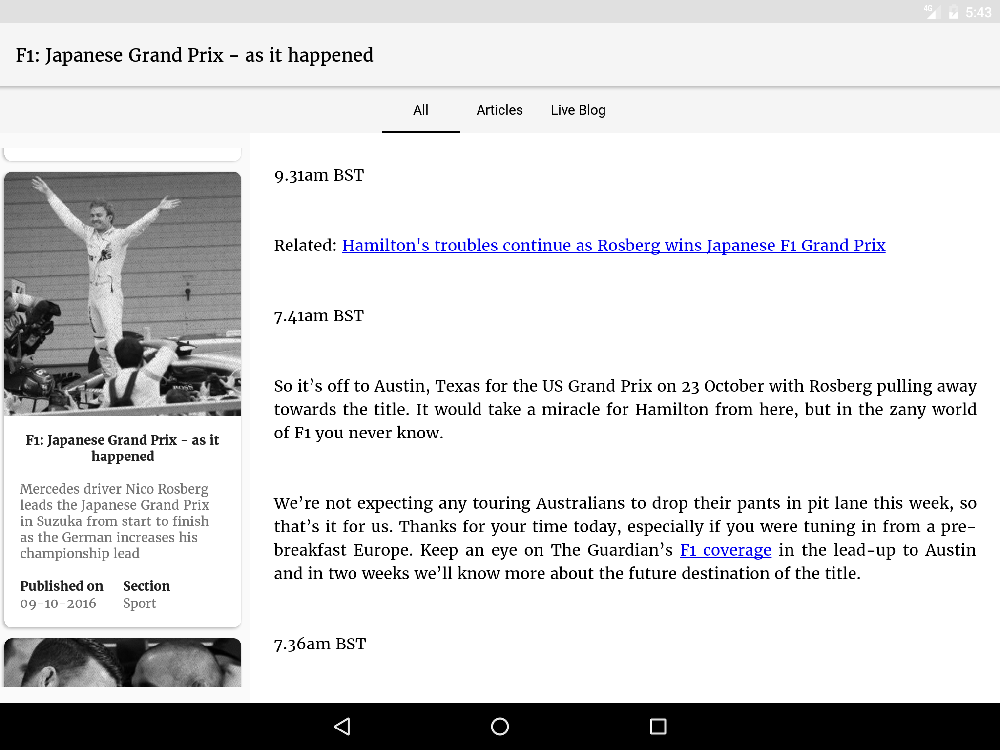

# Old Time Rag

An Android reader for [The Guardian](https://www.theguardian.com) written using their [Open Platform](http://open-platform.theguardian.com/) API.

## Get the app

The app is currently in beta testing. You can download the beta on the [Google Play Store](https://play.google.com/store/apps/details?id=uk.co.mezpahlan.oldtimerag).

## Why the name?

James Edward Taylor founded the Manchester Guardian in 1821. You can read about [the history of The Guardian](https://www.theguardian.com/gnm-archive/2002/jun/06/1) on their website. The name is reference to the old newspaper style of the app.

